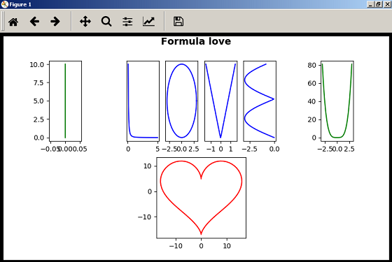
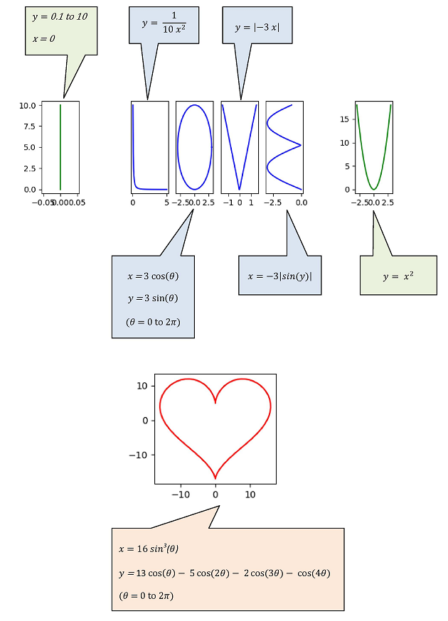

## Requirement

First, Install these packages (matplotlib and numpy) with this command

```js
pip install matplotlib numpy
```

If you install [ANACONDA](https://www.continuum.io/downloads), above packages will install already (including python)

## Codes

[See the source code here](love.py)

You can run with this command.

```js
python love.py
```

### Output



## Formulas in graphs

Describe all formulas in graphs




## References

* https://www.pinterest.com/pin/565201821963867704/
* http://fakeplus.com/pictures/jpg/trust-me-im-an-engineer_20120331032746.jpg
